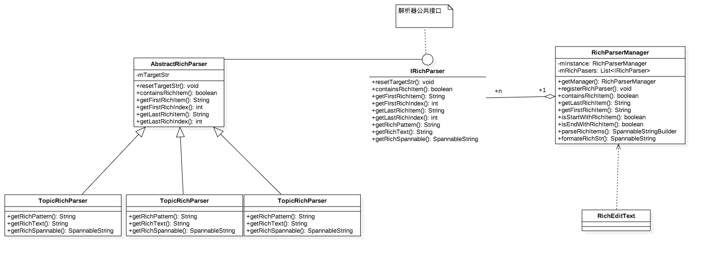
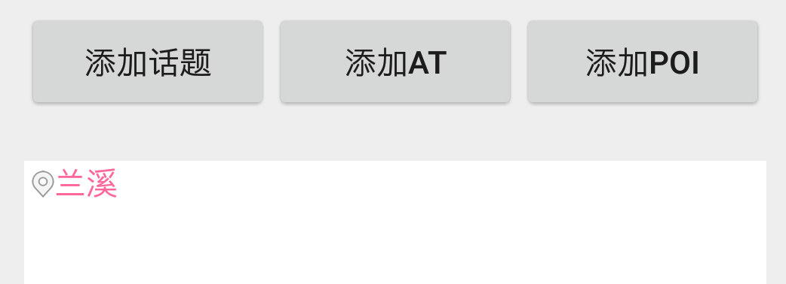
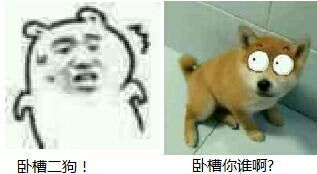

#仿微博富文本编辑框

没图我说个毛？


首先要说明的是：不管是话题、at还是poi，都应该被看成一个最小子项，即不可在中间插入文字，也不可对话题、at或者poi中的任何文字进行单独的修改或者删除。

结合以上，该富文本编辑框的主要功能如下：

- 1、富文本的高亮处理；
- 2、点击话题、at或者poi时光标会落在旁边合适的位置，光标移动时，如果碰到话题等要直接移动跳过整个话题，而不是仍然逐个文字的移动；
- 3、删除话题、at或者poi时，先整体选中，再点一次删除则执行真正的删除操作；
- 4、对于poi这种特殊类型，需要支持图文混排的展示；
- 5、除了对输入的文字进行展示，同时也要有良好的格式以便将用户输入的内容保存或者传输到服务器。

下面，就开始逐个分析吧。


##富文本的高亮处理
这个简单，就是富文本的处理。


##边界判断

现在的很多输入法的键盘都有上、下、左、右移动光标的功能，比如搜狗输入法：


所谓边界判断，就是当用户在键盘上移动光标、或者直接用手指点击输入框调整光标的位置时，如果移动时碰到话题等特殊内容时，自动调整光标到旁边合适的位置。

###监听光标位置
要监听光标的位置，TextView中有一个方法叫`onSelectionChanged`，完整声明如下：

```
    protected void onSelectionChanged(final int selStart, final int selEnd) {
	}
```
当光标每次的位置发生改变时都会回调这个方法，两个形参即分别代表了光标的开始位置和结束位置。

而触发`onSelectionChanged`这个方法的原因基本上有两个：

- 1、用户手动输入文字，导致文字改变同时光标也向后移；
- 2、开发者手动调用`setSelection()`方法移动光标从而导致`onSelectionChanged `的回调。

###调整光标位置
上面说到调整光标的位置，`setSelection()`正好符合我们的需要。该方法在EditText中的完整声明如下：

```
    public void setSelection(int index) {
	}
	
    public void setSelection(int start, int stop) {
	}
```
`setSelection()`有两个重名方法，上面那个是纯粹的移动光标，下面那个是选中一段文字或者调整选区。

对于第1种情况处理起来比较简单，我们主要考虑第2种情况。我们来看一个图：


用户选中中间一段文字之后，如果此时点击键盘上的 "<-"、"->"，此时应该一次性选中富文本，而不是逐个选中每个文字。

###如何判断光标移动到了话题旁边？
好了，监听以及调整光标位置的事情已经解决了，我怎么知道光标移动到了话题、at或者poi的旁边呢？

这就涉及到了正则表达式了。不管是话题、at还是poi，我们都要分别给每种富文本定义一个格式，这里用话题来举例。

话题的格式是：一个空格+一个#+话题内容+一个空格，即" #话题 "（引号内即为一个完整的话题，至于为什么话题不像大家平常见到的那样是两个"#"，我们稍后再讲）。

定下了话题格式之后，就可以写出正则表达式：" #[^#+] "，表示两个空格中间的字符串是#开头的若干个字符。这里推荐一个[在线正则表达式测试](http://tool.oschina.net/regex/)给大家，非常好用。

有了正则表达式，就可以针对话题提供一系列方法：判断字符串中是否包含话题、获取字符串中第一个话题、判断字符串是否以话题开头，等等。

看到这里，怎么判断光标旁边是否是话题就已经非常简单了：

- 1、如果光标是往左移，取光标左边的字符串，并判断这个字符串是否以话题结尾；
- 2、如果光标是往右移，取光标右边的字符串，并判断这个字符串是否以话题开头；


##删除话题
View类中有个方法是`setOnKeyListener(OnKeyListener l)`,通过它可以设置对设备按键的事件进行监听，我们这里只需要监听`KeyEvent.KEYCODE_DEL`即可，每当用户按下删除键便判断光标前面的字符串是否是话题，如果是话题则计算该话题的长度并选中之，如果再次点击删除即删除之。

如果前面的字符串是话题，那怎么判断到底是选中还是删除呢？

第一次按删除时，光标start和end的值肯定是相同的，因为只有一个光标，这时按下删除键肯定是执行选中话题的操作；

选中话题之后，光标变成了两个，这时候start和end值变成了两个，这时候按删除键就直接删除话题了。

所以只需要判断光标start和end的值是否一样即可。

##POI图文混排
平时做图文混排的方式有很多种，但是这里用的是ImageSpan，就不讲了。


##格式化保存
这是最主要的问题，也是之前困扰我很长一段时间的问题，其实回过头来看看也并没有我想的那么复杂，因为我们在前面定义话题格式、写话题正则表达式的时候，一个这样的字符串`这里有一个话题 #话题 不信你看`其实已经包含了很多信息了，所以我们并不需要额外的数据来存储任何其他的信息。

当时想的东西比较多，这么简单一说可能你们不能体会到上面这段话的意思，也可能我表达的不够好。

下面开始分析代码吧。


##源码分析

###架构设计
下面是程序uml类图。



分别说一下图中接口和各个类的作用：

####`IRichParser`
解析器必须实现的接口，规范了一系列方法，分别如下：

```
public interface IRichParser {

    /**
     * 设置待判断的字符串
     *
     * @param text
     */
    void resetTargetStr(String text);

    /**
     * 判断是否是话题的正则表达式
     *
     * @return
     */
    String getRichPattern();

    /**
     * 判断字符串中是否包含话题
     *
     * @param str
     * @return
     */
    boolean containsRichItem();

    /**
     * 获取字符串中的第一个话题,匹配到的结果已经是格式化之后的了,不需要对匹配结果再次格式化
     *
     * @return
     */
    String getFirstRichItem();

    /**
     * 获取字符串中的第一个话题在字符串中的索引
     *
     * @return
     */
    int getFirstRichIndex();

    /**
     * 获取字符串中的最后一个话题,匹配到的结果已经是格式化之后的了,不需要对匹配结果再次格式化
     *
     * @return
     */
    String getLastRichItem();

    /**
     * 获取字符串中的最后一个话题在字符串中的索引
     *
     * @return
     */
    int getLastRichIndex();

    /**
     * 格式化输出
     *
     * @return
     */
    String getRichText(String richStr);

    /**
     * 输出富文本的形式
     *
     * @param richStr
     * @return
     */
    SpannableString getRichSpannable(Context context, String richStr);
}
```
注释说的很清楚了，说几个难懂一点的。

- `void resetTargetStr(String text)`
要明白这个方法，先来看看它的使用场景。比如如果我要判断`"这个字符串中有一个 #话题 "`这样一个字符串中有没有话题，代码是这样写的：

```
boolean isContains = new TopicRichParser().resetTargetStr("这个字符串中有一个 #话题 "). containsRichItem();
```
可以看到，`resetTargetStr()`的作用即每次要对字符串进行判断时，则调用这个方法对要判断的mTargetStr进行设置，然后再调用其他的方法进行判断。

那为什么不在`TopicRichParser`类中直接写一个静态方法呢，比如这样：

```
boolean isContains = TopicRichParser.containsRichItem("这个字符串中有一个 #话题 ");
```
看，多么省事。

乍一看好像挺对，因为我一开始也是这么写的，这么写也没错，目前有话题、at和poi这3种，你可能只需要写3个if else就可以判断完：

```
String targetStr = "这个字符串中有一个 #话题 ";
boolean isContains = false;
if(TopicRichParser.containsRichItem(targetStr)){

	isContains = true;
}else ir( AtRichParser.containsRichItem(targetStr)){

	isContains = true;
}else if(PoiRichParser.containsRichItem(targetStr))

	isContains = true;
}
```
甚至可以写成这样：

```
String targetStr = "这个字符串中有一个 #话题 ";
boolean isContains = TopicRichParser.containsRichItem(targetStr)
							&& AtRichParser.containsRichItem(targetStr)
							&& PoiRichParser.containsRichItem(targetStr) ;
```
对于目前的需求，这种写法是没有问题的，因为现在的富文本样式只有3中，如果以后变成5种、8种甚至更多呢？你需要在每个方法里面重复写这样相似的代码，但是如果有一个接口统一定义了这些方法，然后让子类分别实现各自不同的部分，就可以不用写这么多重复的代码了。

具体细节讲到`RichParserManager`时即可明白了。


####`AbstractRichParser`
实现了`IRichParser`接口，并重写了所有子类共同的方法，但是对于需要不同实现的方法仍然保持没有实现的状态。具体情况如下：

- 已实现部分：`resetTargetStr`、`containsRichItem`、`getFirstRichItem`、`getFirstRichIndex`、`getLastRichItem`、`getLastRichIndex`

- 未实现部分：`getRichPattern`、`getRichText`、`getRichSpannable`

####`TopicRichParser`、`AtRichParser`、`PoiRichParser`：
均继承自`AbstractRichParser`，并实现了父类所有虚方法（`getRichPattern`、`getRichText`、`getRichSpannable`），负责提供判断富文本的正则表达式、输出富文本字符串、输出富文本。
####`RichParserManager`:
上面介绍`IRichParser`说到：如果富文本样式有很多种时，如果仍然用`静态方法+if else`这种陈旧落后的方式将导致重复代码太多，最重要的是容易出错，如果某个方法中漏写了某种富文本的判断，则可能导致最终的结果并不准确。
在`RichParserManager`中是怎么处理的呢？

```
public class RichParserManager {

    private static RichParserManager mInstance;
    private List<IRichParser> mRichPasers;

    private RichParserManager() {
        mRichPasers = new ArrayList<>();
    }

    public static RichParserManager getManager() {
        if (null == mInstance) {
            synchronized (RichParserManager.class) {
                if (null == mInstance) {
                    mInstance = new RichParserManager();
                }
            }
        }
        return mInstance;
    }

    /**
     * @param richParser
     */
    public void registerRichParser(IRichParser richParser) {

        //是否需要去重处理?
        mRichPasers.add(richParser);
    }

    /**
     * 判断是否包含富文本bean
     *
     * @param str
     * @return
     */
    public boolean containsRichItem(String str) {

        if (TextUtils.isEmpty(str)) {
            return false;
        }
        for (IRichParser richItem : mRichPasers) {
            richItem.resetTargetStr(str);
            if (richItem.containsRichItem()) {
                return true;
            }
        }
        return false;
    }

    /**
     * 获取字符串中的最后一个富文本串
     *
     * @param targetStr
     * @return 最后一个"话题"或者最后一个"@"或者其他,如果没有富文本串,则返回空字符串("")
     */
    public String getLastRichItem(String targetStr) {
		//细节省略
    }

    /**
     * 获取字符串中的最后一个富文本串
     *
     * @param targetStr
     * @return 最后一个"话题"或者最后一个"@"或者其他,如果没有富文本串,则返回空字符串("")
     */
    public String getFirstRichItem(String targetStr) {
		//细节省略
    }

    /**
     * 是否以富文本开头
     *
     * @param targetStr
     * @return
     */
    public boolean isStartWithRichItem(String targetStr) {
		//细节省略
    }

    public boolean isEndWithRichItem(String targetStr) {
		//细节省略
    }

    /**
     * 解析字符串中的富文本并返回一个经过格式化的富文本串
     *
     * @param targetStr
     * @return
     */
    public SpannableStringBuilder parseRichItems(Context context, String targetStr) {
		//细节省略
    }

    private SpannableString formateRichStr(Context context, String richStr) {
		//细节省略
    }
}
```
`RichParserManager`采用单例模式对所有`IRichParser`进行管理，上面的需求中只有3中富文本，假设现在添加一种“音乐”类型的富文本，则只需要定义一个`MusicRichParser`继承自`AbstractRichParser`，并实现所有方法，然后调用`RichParserManager `的`registerRichParser()`即可使编辑器支持对`音乐`类型的富文本解析。

是不是很简单？说出来你可能不信，实际操作起来简单到我自己都怕。


举个栗子，如果要判断字符串是否包含富文本，外部只需要用下面的代码即可：

```
boolean isContains = RichParserManager.getManager().containsRichItem("这个字符串中有一个 #话题 ");
```
是不是非常简单？再来看`containsRichItem()`的实现:

```
public boolean containsRichItem(String str) {

        if (TextUtils.isEmpty(str)) {
            return false;
        }
        for (IRichParser richItem : mRichPasers) {
            richItem.resetTargetStr(str);
            if (richItem.containsRichItem()) {
                return true;
            }
        }
        return false;
    }
```
如你所见，正是遍历所有的`IRichParser`，依次检查是否含有富文本，这样既不会在检查每种富文本的时候都写重复的代码，而且也不会遗漏任何对任何一种富文本的检查（只要你一开始调用过`RichParserManager.getInstance().registerRichParser()`注册过）。

其他方法类似，不多提了。

###话题、AT、POI，以及以后任何可能的富文本样式
假设现在添加一种“音乐”类型的富文本，则只需要定义一个`MusicRichParser`继承自`AbstractRichParser`，并实现下列3个方法即可：

- `getRichPattern` 提供正则表达

- `getRichText` 格式化输出富文本字符串

- `getRichSpannable` 将字符串富文本化(图文混排)等

`getRichText`和`getRichSpannable`有什么区别呢？


恩，这是个好问题。我们用POI富文本来举例，先来看一个图：



这是一个poi富文本图文混排之后的结果，poi的正则表达式是` &[^&]+ `，即两个空格中间是一个`&`开头的字符串。所有符合这种格式的字符串都将被解析成poi。

所以对于上图中的poi，它的真实字符串其实是` &兰溪 `，而且这也是调用`getRichText()`得到的结果。`getRichText()`代码如下：

```
    @Override
    public String getRichText(String richStr) {
        return String.format(" &%s ", richStr);
    }
```

而为什么会输出成上图中图文混排的结果呢？这就要看`getRichSpannable()`中的实现了。

```    @Override
    public SpannableString getRichSpannable(Context context, String richStr) {

        if (TextUtils.isEmpty(richStr)) {
            return new SpannableString("");
        }
        String str = richStr;
        SpannableString spannableString = new SpannableString(str);
        //color spannable
        ForegroundColorSpan highLightSpan = new ForegroundColorSpan(Color.parseColor("#FF6699"));
        spannableString.setSpan(highLightSpan, 0, str.length(), Spanned.SPAN_INCLUSIVE_EXCLUSIVE);
        ImageSpan imageSpan = new CenteredImageSpan(context, R.mipmap.poi);
        spannableString.setSpan(imageSpan, 1, 2, Spanned.SPAN_INCLUSIVE_EXCLUSIVE);
        return spannableString;
    }
```
在`getRichSpannable()`方法中，形参的值一般是`getRichText()`返回的结果，对于上图，这里的形参即为：` &兰溪 `。

在`getRichSpannable()`的第9~10行，先将富文本字符串颜色高亮。

第11~12，将`&`替换成POI富文本的icon。

看到这里是不是一切都了然了，所以这里的`&`其实是充当了一个占位符的作用。事实上如果你回过头去看，不管是话题、at还是poi，都有一个占位符。他们分别是`#`、`@`、`&`，只不过at的保留了占位符，而话题的占位符被我替换成了一个透明图片。

调用`getRichSpannable()`得到SpannableString之后，在Edittext中调用setText()就可以将上面所有的更改显示到界面上了。

为什么要采用这种策略呢？

对于在EditText中图文混排这件事情本身是不困难的，但是现在要支持对一个特定格式的富文本进行正则表达式的判断以及各种处理，特别是光标的控制，假设没有占位符，直接将图片加在文字前面变成富文本，光标移动的时候计算的文字长度仍然是原来的长度，而显示在屏幕上的富文本长度其实是超过了文字的实际长度，所以就有可能出现光标移动时被文字或图片遮挡等等各种奇怪的bug。

不知道你们能不能明白，这个需要自己去体会了。

###RichEditText

上面说了很多，都是针对架构的设计，可能很啰嗦但是如果不讲上面的话下面有的地方可能不好理解，下面讲下`RichEditText`中的实现吧。


####删除事件
先来看对删除按键的事件监听：

```
    public RichEdittext(Context context, AttributeSet attrs, int defStyleAttr) {
        super(context, attrs, defStyleAttr);

        setBackgroundColor(Color.WHITE);
        setOnKeyListener(this);
    }

    /**
     * 监听删除按键，执行删除动作
     */
    @Override
    public boolean onKey(View v, int keyCode, KeyEvent event) {
        //按下键盘时会出发动作，弹起键盘时同样会触发动作
        if (keyCode == KeyEvent.KEYCODE_DEL && event.getAction() == KeyEvent.ACTION_DOWN) {

            if (startStrEndWithRichItem() && getSelectionStart() == getSelectionEnd()) {

                int startPos = getSelectionStart();
                final String startStr = toString().substring(0, startPos);

                //获取话题,并计算话题长度
                String richItem = RichParserManager.getManager().getLastRichItem(startStr);
                int lenth = richItem.length();

                //方案1: 先选中,不直接删除
                setSelection(startPos - lenth, startPos);

                //方案2: 直接删除该话题
//                String temp = startStr.substring(0, startStr.length() - lenth);
//                setText(temp + toString().substring(startPos, toString().length()));
//                setSelection(temp.length());

                return true;
            }
        }
        return false;
    }
```

代码第5行，开启对按键事件的监听，第8~37行，就是重写的`View.OnKeyListener`中的回调方法。

第14行，过滤掉除`删除键按下`以外的事件。

第16行，如果光标前面的字符串是以话题结尾，则进行特殊处理。

第18~19行，截取光标前面的所有字符。

第21~23行，获取上一步截取的字符串中的第一个富文本，并且得到这个富文本的长度。

第25~26行，选中该富文本。

上面是第一种方案，如果不选中富文本直接删除这个话题，如代码28~31。

第33行，返回true表示已经处理了本次删除事件。

第16行`startStrEndWithRichItem()`判断光标前面的字符串是否以话题结尾，源码如下：

```
    public boolean startStrEndWithRichItem() {

        int startPos = getSelectionStart();
        final String startStr = toString().substring(0, startPos);
        if (!RichParserManager.getManager().containsRichItem(startStr)) {
            return false;
        }

        String lastTopic = RichParserManager.getManager().getLastRichItem(startStr);
        return startStr.endsWith(lastTopic);
    }
```

第3~4行，先截取光标前面的字符串。

第5~7行，如果字符串中没有富文本，则直接返回false。

第9行，获取字符串中最后面的一个富文本。

然后在第10行判断这个字符串中是否以这个富文本结尾即可。

至此，`删除的时候当光标碰到富文本，可以先选中富文本再按一次删除时就删除，也可以直接把富文本删除`的这个功能就实现了。



####光标移动
光标移动的场景主要有4个：

- 输入文字时
- 插入、删除文字时；
- 用键盘上下左右移动光标；
- 直接点击输入框，改变光标的文字；

针对所有的光标移动，由于我们只能在光标移动后监听到光标位置的改变，所以我们没有办法在移动光标前决定光标应当移动到哪个位置，只能在光标移动完成后通过`对光标移动后的位置进行判断，并重新调整光标到合适的位置`。

比如如果光标移动后落在富文本中间，则应当调整光标移动到富文本旁边，所以光标的移动用“调整”、“修正”来形容更加贴切一些。

对于上面的4种情况，我们依次来分析。

第1种情况：输入文字时光标自动移动到后一位，不用特殊处理。

第2种情况：插入文字、富文本时，光标要移动一个富文本的长度；删除富文本时，光标也要移动一个富文本的长度。

第3种情况又有两类：

- 光标的开始位置和结束位置相同，移动时只需要判断移动后是否落在富文本中间，如果是则将光标的开始位置和结束位置都移动到富文本旁边；

- 光标的开始位置和结束位置不同，即此时用户已经选中了一段文字，这时候如果对光标的开始位置和结束位置分布进行上下左右的移动，则要对光标的开始位置和结束位置分别进行处理和移动。

第4种情况，其实就是第3种情况中的第1类。


具体代码大致如下：

```
    @Override
    protected void onSelectionChanged(final int selStart, final int selEnd) {
        super.onSelectionChanged(selStart, selEnd);

        //调用setText()会导致先触发onSelectionChanged()并且start和end均为0,然后才是正确的start和end的值
        if (0 == selStart && 0 == selEnd) {
            mOldSelStart = selStart;
            mOldSelEnd = selEnd;
            return;
        }

        //避免下面的setSelection()触发onSelectionChanged()造成死循环
        if (selStart == mNewSelStart && selEnd == mNewSelEnd) {
            mOldSelStart = selStart;
            mOldSelEnd = selEnd;
            return;
        }

        int targetStart = selStart, targetEnd = selEnd;
        String text = toString();
        //如果用户不是通过左移右移来改变位置,而是直接用手指点击文字使光标的位置发生改变
        if (selStart == selEnd && Math.abs(selStart - mOldSelStart) > 1) {

            //如果移到了话题内,则改变移动到其他合理的地方
            int pos = getRecommendSelection(selStart);
            if (-1 != pos) {
                setSelection(pos, pos);
                return;
            }
        } else {
            //光标左边往右
            if (mOldSelStart < selStart) {
                //事实上,onSelectionChanged()回调时位置已经改变过了
                // ,所以当光标左边往右移动时,如果需要判断光标当前位置pos后是否是一个话题时
                // ,应该判断pos-1时候的位置来判断(或者oldPos,但是oldPos是自己计算出来的,并不一定精准所以)
                int startPos = selStart - 1;
                String endStr = text.substring(startPos, text.length());
                if (RichParserManager.getManager().isStartWithRichItem(endStr)) {

                    String richStr = RichParserManager.getManager().getFirstRichItem(endStr);
                    targetStart = startPos + richStr.length();
                }
            }
            //光标左边往左
            else if (mOldSelStart > selStart) {

                int startPos = selStart + 1;
                //逐个删除文字时,selStart + 1会导致数组越界
                startPos = startPos < text.length() ? startPos : text.length();
                String startStr = text.substring(0, startPos);
                if (RichParserManager.getManager().isEndWithRichItem(startStr)) {

                    String richStr = RichParserManager.getManager().getLastRichItem(startStr);
                    targetStart = startPos - richStr.length();
                }
            }

            //光标右边往右
            if (mOldSelEnd < selEnd) {

                int endPos = selEnd - 1;
                String endStr = text.substring(endPos, text.length());
                if (RichParserManager.getManager().isStartWithRichItem(endStr)) {

                    String richStr = RichParserManager.getManager().getFirstRichItem(endStr);
                    targetEnd = endPos + richStr.length();
                }
            }
            //光标右边往左
            else if (mOldSelEnd > selEnd) {

                int endPos = selEnd + 1;
                String startStr = text.substring(0, endPos);
                if (RichParserManager.getManager().isEndWithRichItem(startStr)) {

                    String richStr = RichParserManager.getManager().getLastRichItem(startStr);
                    targetEnd = endPos - richStr.length();
                }
            }
        }
        //保存旧值
        mOldSelStart = selStart;
        mOldSelEnd = selEnd;
        //保存新值
        mNewSelStart = targetStart;
        mNewSelEnd = targetEnd;
        //更新选中区域
        setSelection(targetStart, targetEnd);
    }
```

##没解决的bug
上面录制的那张gif看上去是不是很美好，但是事实很残酷，实际操作的时候，还是有两个bug。
- 程序大部分功能基本上没有问题，但是删除话题有的时候删不了，因为有个先选中再删除的过程，不知道为什么选中的时候老是选中不了，所以造成删除话题时一直跳过。

解决办法是：去掉先选中再删除的逻辑，当删除时碰到话题，按删除即直接删除整个话题，而不要选中了。

- 移动选区时，光标没办法跳过整个富文本，光标仍然可以跑到富文本文字中间。

打断点调试的时候逻辑都是对的，打印log的时候貌似是onSelectChanged方法有多次调用导致对正常判断造成了干扰。囧~

如果解决了bug我会及时更新的，欢迎大神前来指点。

--------------
（2017.1.19日更新，这两个bug均已解决，非常感谢`Panjianan `同学提供的思路 ）


关于
--

博客：[http://blog.csdn.net/aishang5wpj](http://blog.csdn.net/aishang5wpj)

邮箱：337487365@qq.com

License
--
Copyright 2016 aishang5wpj

Licensed under the Apache License, Version 2.0 (the "License"); you may not use this file except in compliance with the License. You may obtain a copy of the License at

http://www.apache.org/licenses/LICENSE-2.0

Unless required by applicable law or agreed to in writing, software distributed under the License is distributed on an "AS IS" BASIS, WITHOUT WARRANTIES OR CONDITIONS OF ANY KIND, either express or implied. See the License for the specific language governing permissions and limitations under the License.